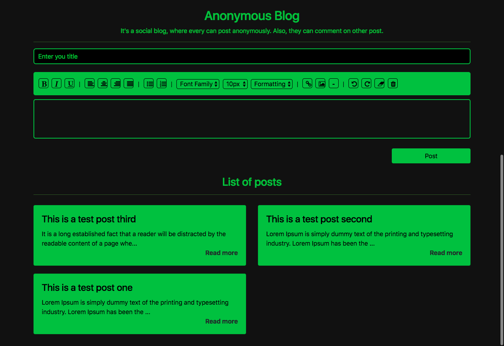
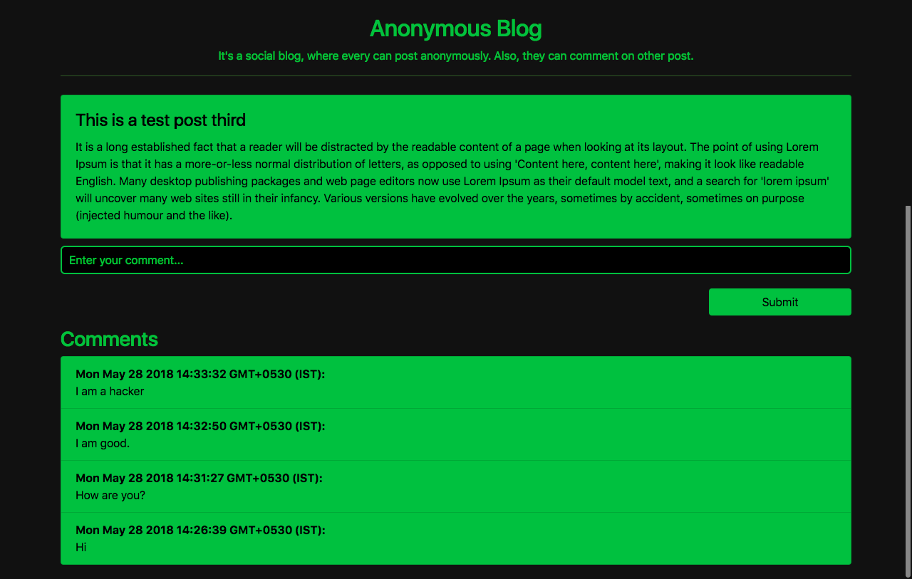

# Social anonymous blog using MEAN (Mysql, Express js, Angular js & Node js) - (SQL file included)
This is a anonymous blog, where the user can post without login & submit their comment on the post.

# Features

1. RESI API using Node Express js
2. Angular js UI
3. Public timeline
4. Post
5. Comment

# Screenshots

Posts list page

Posts detais page

Thanks
Krishna
sendmail2krrish@gmail.com